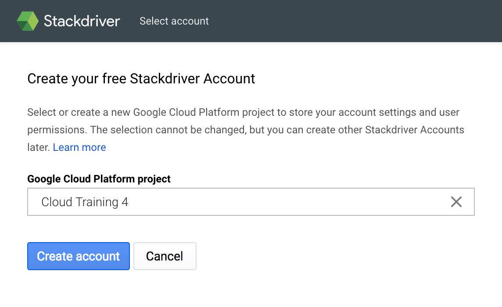
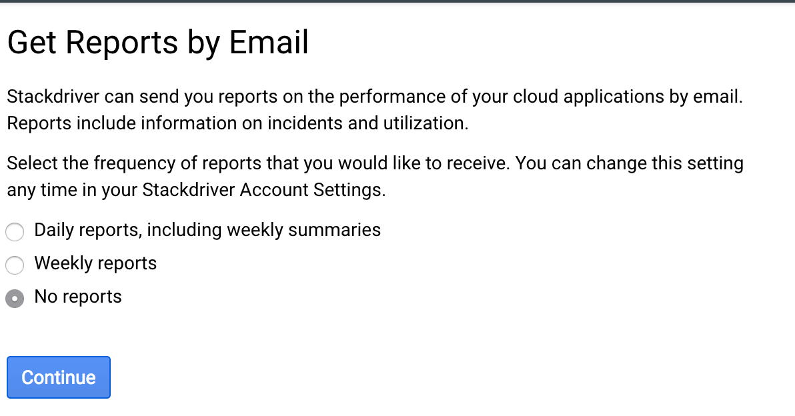
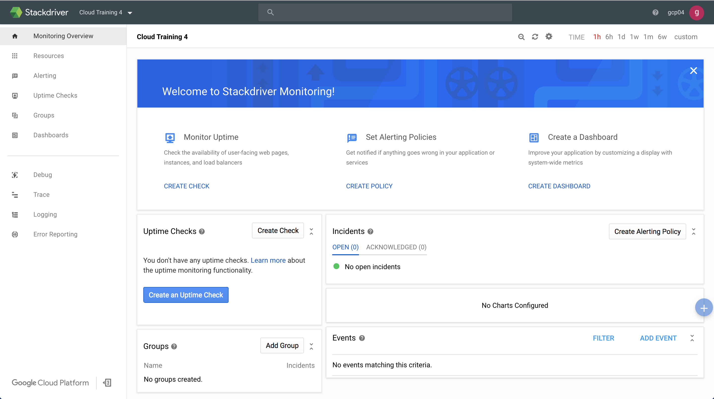
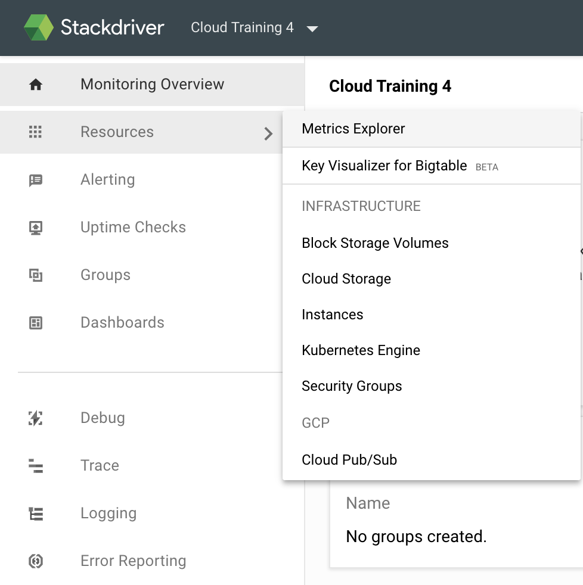
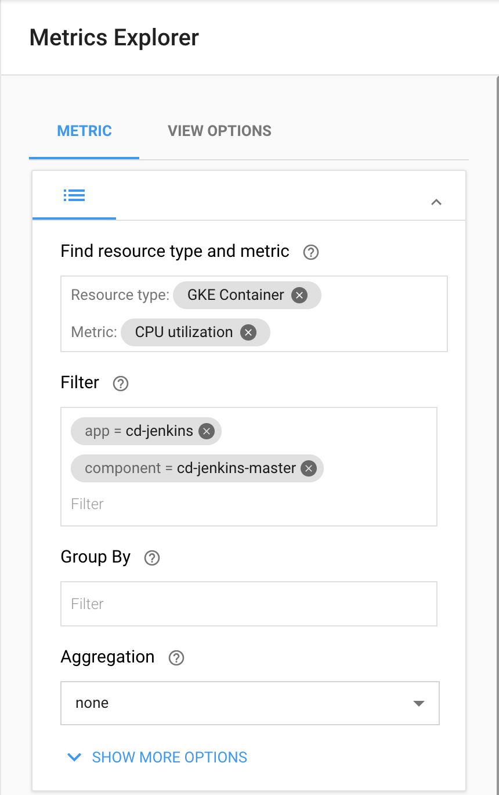
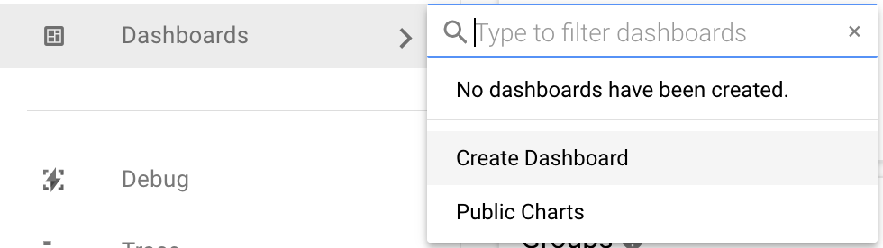
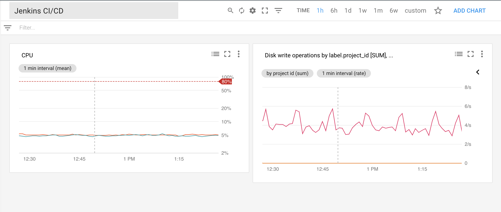
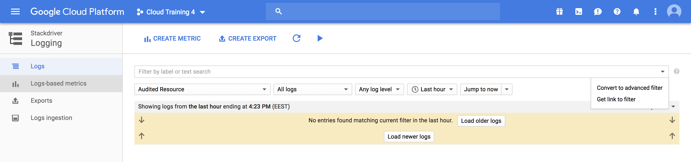

Monitoring and Logging
====================

Objectives
----------

- enable monitoring for an existing Kubernetes cluster
- examine metrics in the Stackdriver console
- build custom Stackdriver dashboard for CI/CD pipeline and service
- enable Stackdriver logging
- view Jenkins logs in the Stackdriver console

Enable monitoring
-----------------

By default, when you create a Kubernetes GKE cluster, the `--enable-cloud-monitoring` flag is automatically set.

Go to the GKE console to check this: https://console.cloud.google.com/kubernetes/clusters/details/us-west2-b/jenkins-cd

Make sure the "Stackdriver monitoring" checkbox is turned on.

Create Stackdriver account
--------------------------

Depending on the state of your training account you may or may not have Stackdriver account associated.

Go to Monitoring secltion of the Web Console. If you see "Create your free Stackdriver Account" window then proceed. If not, skip to the next section.



1. Click "Create account" button

1. Continue

1. Skip AWS Setup

1. Install the Stackdriver Agents: Continue

1. Select "No Reports" when asked

    

1. Launch Monitoring

1. You should see Stachdriver dashboard now

    

Examine metrics
---------------

1. Go to the Resources > Metrics Explorer dashboard

    

1. Select the resource type "gce_instance"

1. Select the metric type "CPU Utilization"

1. Look at the graph of the nodes CPU utilization. Note there are no master nodes as they are managed by Google

1. Select resource type "gke_container"

1. Select metrics type "CPU Utilization"

1. Filter to the Jenkins pod

    

1. View the graph of CPU usage by Jenkins master

Metrics may not be available at this time as the collection started minutes ago. If so, check the graph in 10 minutes.

Build the Dashboard
-------------------

In this exercise, you will create a dashboard that shows metrics about GKE cluster where the Jenkins instance runs.


1. Click Dashboards > "Create new dashboard" button

    

1. Click "Add Chart" button

1. Chart Title = "CPU"

1. Select "CPU utilization" metrics for "GCE VM instance"

1. Go to "View Options"

1. Set the treshold to 80%

1. Check "Log scale on Y-axis"

1. Save the chart

    Now let's add the second chart.

1. Click "Add Chart" button

1. Chart Title = "Disk Usage"

1. Select "Disk write operations" metrics for "GCE VM instance"

1. Select "Group By: project_id"

1. Make sure the aggregation function is "sum"

1. Click "Add Metric"

1. Repeat for "Disk read operations" metric

1. Click "Save"

1. Name your dashboard "Jenkins CI/CD"



Enable logging
--------------

By default, when you create Kubernetes GKE cluster, the `--enable-cloud-logging` flag is automatically set.

Go to the GKE console to check this: https://console.cloud.google.com/kubernetes/clusters/details/us-west2-b/jenkins-cd

Make sure the "Stackdriver logging" checkbox is turned on.

View logs
---------

There are two types of logs: _container_ and _system_. Container logs are collected from the running containers. System logs are produced by cluster components like `kubelet` and `api`. There are also events like cluster creation that are produced by Google cloud.

View container logs

1. Go to the Logging dashboard of the Web Console.

1. Switch to advanced mode

    

1. Edit the filter

    ```shell
    resource.type="container"
    resource.labels.namespace_id="cd"
    resource.labels.cluster_name="jenkins-cd"
    resource.labels.container_name="cd-jenkins"
    ```

    You will see logs from the Jenkins master container.

    While editing the filter, you can use auto competition ("Control+Space") to explore possible options.

1. Find the record that shows you Jenkins was started and ready to serve requests

    View system logs

1. Switch back to basic mode

1. Select "GKE Cluster Operations -> jenkins-cd"

1. Find the record that tells you which node jenkins master pod was scheduled

You can convert the filter to advanced mode and look at it:

```shell
resource.type="gke_cluster"
resource.labels.cluster_name="jenkins-cd"
```

View platform events
--------------------

You can view the events Google cloud associate with your cluster.

1. Select "GKE Cluster Operations -> jenkins-cd"

1. Select log type: "activity"

1. Find the record which tells you when the cluster was started.

Optional exercises
------------------

### Alerts

Stackdriver allows you to set alerts based on the events. Create the alert that sends an e-mail when the node pool is resized.

To do this:

  - add one node to the cluster node pool
  - find out how the message about cluster resizing looks like
  - set up the alert in Stackdriver dashboard
  - delete one node from the cluster node pool
  - see the e-mail arrived at you mailbox

Questions:

1. How to evacuate pods from the node that will be removed from the pool?
1. If deployment has one replica running on the removed node how pool resizing will impact application availability?
1. About what three events would like to get notifications in the production environment?
1. Is it a good idea to send e-mail notification? If not, why?

---

### Log-based metrics

Sometimes not a single event matters but their total count or the rate of change. For example the number of evicted containers. Container may be evicted from the node by a number of reasons. Cluster may be overloaded and scheduler needs resources for the container with the higher QoS guaranttes. Or the nodes are being upgraded and pods are moving to the new virtual machines. Maybe one big node has a disk failure and operator drains it for the maintanance. All these cases have the same outcome — a large number of containers evicted.

To track such events we will use "Log-based metrics".

  - find out how does the message about container eviction looks like. Drain the node and find the messages in Logging console
  - create a metric counting total number of container evicted
  - set the alert based on this metric
  - drain another node and see the result

Questions:

1. What other events that are not meaningful by themselves, but their rate or total quantity are important for the cluster operations?

---
### Custom metrics

In the main track we worked with either system metrics or metrics based on log messages. What if one would like to track build times and number of executors? You need to gather custom metrics from the Jenkins deployment into Stackdriver.

To do this:

  - install [jenkins-prometheus plugin](https://github.com/jenkinsci/prometheus-plugin)
  - configure it to use `stackdriver-prefix=custom.googleapis.com`
  - use [prometheus-to-sd](https://github.com/GoogleCloudPlatform/k8s-stackdriver/tree/master/prometheus-to-sd) component to send  metrics to the Stackdriver
  - trigger several builds in Jenkins
  - watch the metrics in the metrics explorer
  - add the metrics charts to the Jenkins CI/CD dashboard

---
### Stackdriver Kubernetes monitoring

Take a look at new Kubernetes/Stackdriver dashboard which is currently in beta: https://cloud.google.com/monitoring/kubernetes-engine/

  - you need to create another k8s cluster for this exercise: there is no migration path for existing clusters yet
  - try to complete the previous exercises in the new interface
  - what are the main differences between the previous version and this one?
